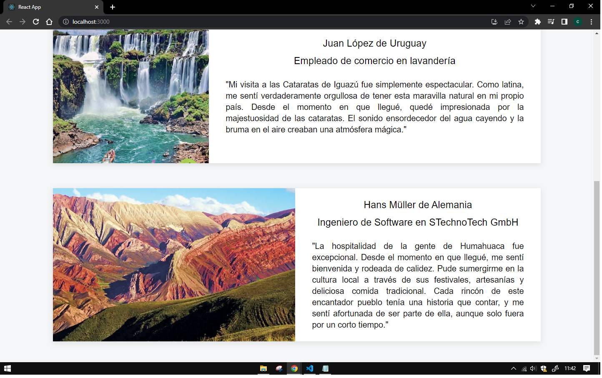

Esta es una aplicación desarrollada con React que representa una sección de Testimonios de una pagina web de viajeros ficticia.

Su estructura inicial fue creada con el comando `npx create-react-app`.

## Ejecutar la Aplicación
Para iniciar la aplicación, ejecutar `npm start` en la terminal.

## Instalar Módulos
Para instalar los módulos necesarios para la aplicación, debes ejecutar `npm install`.

## Vista previa

